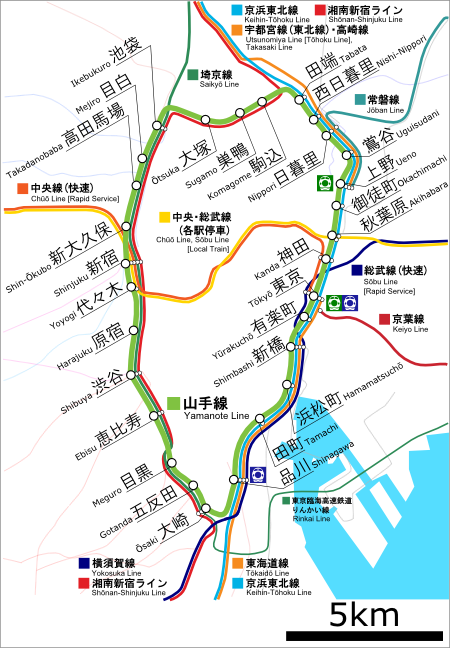
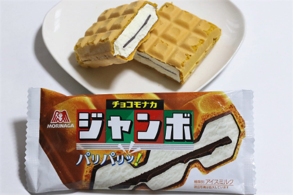
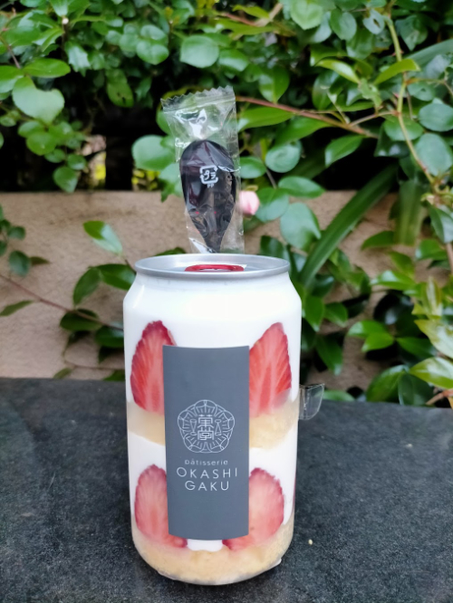

# Japan

[[toc]]

## Before arrival

### Connectivity / Communication

Figure out your mobile/data situation before you get there.  Trying to connect to airport wifi can be slow/tricky, so plan ahead.

- Enable your international data/roaming on your mobile carrier
- Activate your e-sim before your flight
- Book/reserve a mobile hotspot to pickup at the airport

### Money / Payment

While many places take credit card (Mastercard/Visa) there are still quite a few places that take cash.

Instead of bringing USD cash and paying exchange rate + fees, withdraw Japanese Yen at an ATM typically found
at convenience stores (7-11, Family Mart, Lawson, etc).  **I highly recommend** using a Schwab free checking account (No Foreign Transaction Fees And Unlimited ATM Fee Rebates For Cash Withdrawals Worldwide)

For public transportation, I recommend getting a transportation card that you can recharge/refill at a machine.  If you have iPhone, you can download/setup the card and skip the hassle of having to find and buy a physical card
[Add a Suica, PASMO, or ICOCA card to Apple Wallet](https://support.apple.com/en-us/108772)

### Etiquette

- Do stand aside on stairs/escalators so that others can pass you
- Do NOT talk while on public transportation
- Do NOT walk and eat
- Do NOT tip (considered rude/offensive in some places)

There's many more, but a general rule of thumb: be mindful of other people around you.

#### Trash

Due to terrorist attacks in the 1990's involving trash cans, public bins / garbage cans were removed.
Should you need to find a trash can, you can typically find them at the train stations or at convenience stores.

## Tokyo (General)

### Safety

Japan is generally a safe country, however things to watch out for / avoid:

- Touts that promote their bar / club.  Typically they will claim it's all you can drink but they later slam 
  you with a large bill with extra charges and fees.  Some people have reported to have been drugged and wake up to
  have their cards billed/stolen.  This appears to be a problem mostly in the party/drinking areas (Shinjuku, Shibuya, and Roppongi areas)

- Sexual assault and hidden cameras, typically on crowded trains and public places.  You will typically see a women-only section of a train
  for this reason.

### Accommodation

I recommend booking a hotel near a major train line, specifically the Yamanote line

It loops around the city and gets connects to the majority of touristy places in Tokyo

### Food chains

1. **CoCo Ichibanya**

Fast food curry rice that allows you to specify how much rice and spiciness level.  I prefer the chicken katsu and pork katsu at spiciness level 3 or 4.

2. **Convenience Stores**:  7-11, Lawson, Family Mart

Egg sandwiches!  Each chain tastes a little different, I think ones from Family Mart were my favorite

Choco Monaka Jumbo (Ice cream bar)

3. **Mister Donut**

## Northeast Tokyo

- [Tokyo Skytree](https://maps.app.goo.gl/ypcwRbW5Rw8p8qRf7)

Get a 360 degree view of the city at [Tokyo Skytree](https://maps.app.goo.gl/ypcwRbW5Rw8p8qRf7), on a clear day you
can see Mount Fuji.  While you're there, I recommend trying the [strawberry shortcake in a can](https://maps.app.goo.gl/4Rtk2PTZFYYWa5Ga6)

More lowkey place to view the city: [Asahi Sky Room](https://maps.app.goo.gl/gBwbVvSjbLUvnScq9) - they have a minimum order requirement, they serve beer and snacks

- [Sensō-ji Temple](https://maps.app.goo.gl/pLJCSkcPtjr4oVDr7)

  You can donate some money to pull your fortune from one of the sticks/drawers.

- [Melon Pan bread](https://maps.app.goo.gl/WXPS9LfnHY9ca4cu6)

  Can order with ice-cream, just by itself is just as good

- [Tonkatsu Hasegawa](https://maps.app.goo.gl/gpKN6KXtZT8p41iN9)

  My currently favorite Tonkatsu place, reservations not needed but recommended.  I am usually able to get seated at dinner opening.  
  I highly recommend getting their premium cut Tonkatsu - limited daily supply.

- [Tempura Hasegawa](https://maps.app.goo.gl/Cg9dgSarv9rwd2Ri8)

  On my list of places to try

- [Otter cafe](https://maps.app.goo.gl/vy3q7UUKgRqxnX7T9)

  You can feed / play with otters (and other animals), reservations required

### Akihabara

All things nerdy, arcades, anime, manga, maid cafes, etc.  You'll occassionaly see a street Mario Kart group drive through here.

#### Food

- [Gyukatsu Motomura (Akihabara Branch)](https://maps.app.goo.gl/pQKgSjdHDUv77brP9)

  Deep-fried beef cutlet, you cook on your own little charcoal grill.  A food chain you can find in other parts of Tokyo

- [Roast Beef Ōno](https://maps.app.goo.gl/DPT8jD1wtL7uNFvMA)

## Southeast Tokyo

- [DisneySea](https://maps.app.goo.gl/aVVzUTYZMjmoSxir8)
- [TeamLab Planets](https://maps.app.goo.gl/RiM6EJu2wAbFtoxr9)

  Highly recommended!  (I prefer this over TeamLab Borderless, as it's more interactive / tactile) Reservations required, go when it opens, wear pants that you can roll up

### Ginza

Luxury shopping mall [Ginza Six](https://maps.app.goo.gl/ncJ5tTQtTAKb8aeR6)

#### Food

- [Age.3](https://maps.app.goo.gl/BsqfTxhync2aR8xHA)

  Fried sandwich (more of a dessert)

- [Ginza Kagari](https://maps.app.goo.gl/amJrVWk4R63DQn5q8)
  
  Used to have a Michelin star (all ramen shops have now lost Michelin star).  Get the chicken w/ truffle broth ramen.

## Southwest Tokyo

- [TeamLab Borderless](https://maps.app.goo.gl/Xmg7y7rR8gRd5XV68)

  Art exhibit which was remodeled recently, highly recommended.  If you are short on time and can only do one, I 
  recommend TeamLab Planets instead

### Yokohama

Lot of museums

- [Ramen Museum](https://maps.app.goo.gl/Pd3WURWZQgmoyFhx7)
  
  Interesting decor, the bottom floor is a bunch of ramen shops you can try (not really that good IMO).  I would recommend the Cup Noodles Museum instead

- [Cup Noodles Museum](https://maps.app.goo.gl/xL1Fc5gJi1yuJSfQA)

  There is an option to do the make-your-own-noodles-cup 

### Harajuku

The fashion district, home to a lot of cafes and shopping.

- [Harajuku Mame Shiba Cafe](https://maps.app.goo.gl/tMSsYn25kCUnSTrt8)
- [Capybara Cafe](https://maps.app.goo.gl/gw2qNhMzKFQQMBBeA)

#### Food

- [Starbucks Reserve® Roastery Tokyo](https://maps.app.goo.gl/gxVRSYSVFSd6YFtC8)
  
  This place is huge, sometimes a wait to get in.  It's a bit far from the main train stations, but sits on the Meguro river (popular spot during cherry blossom season)

- [Hikiniku to Come](https://maps.app.goo.gl/TUpEPtA9UHxQ5WZR6)

  Burger patty, rice, egg.

- [Roast Beef Ohno](https://maps.app.goo.gl/7N3MB7VuH25W3Cxd7)
- [Gyukatsu Motomura](https://maps.app.goo.gl/oMDFxaU2Nide3WTj8)

### Shibuya

The famous Shibuya Crossing, hard to miss if you're coming from the train station

- [Hachikō Memorial Statue](https://maps.app.goo.gl/XKQSPKntYXvBd9oU9)

#### Food

- [Uogashi Nihon-Ichi](https://maps.app.goo.gl/m8fHgZU8nAxUaVsL8)

  Standing sushi bar, usually a wait but line goes pretty quickly.  You stand at the sushi bar, point to what sushi you want and they make it,
  super quick and cheap.  Better quality than conveyor belt sushi.

